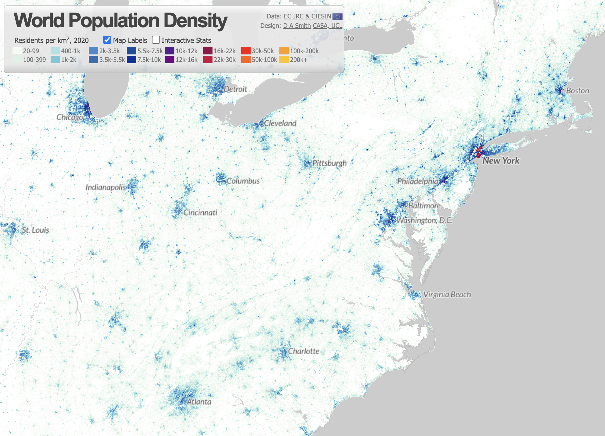
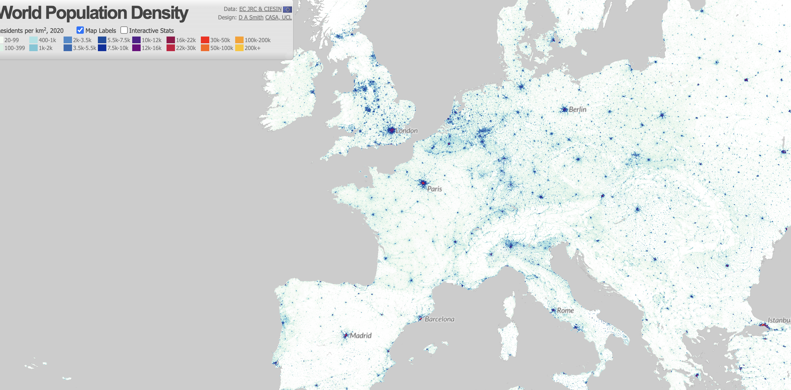
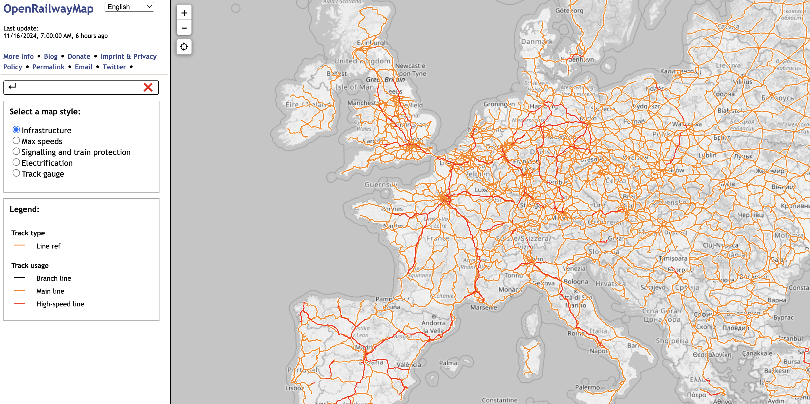

# Transit Time

I was recently in Europe (Paris - Salzburg - Munich - Porto - Lisbon). Of course the food, the drinks, the sights and the people (especially Portugese, which absolutely rank among the top 5 friendliest people I've ever met) were all amazing. But as a recovering Transportation Modeler for a mid-size Southern US city, I couldn't help but be awed by the transit systems. The German system in particular was stereotypical efficient, but the Paris Metro was also a marvel. There's been an immense quantity of literature and thinking on why the US transit system falls behind in comparison, both from a purposeful funding decisions and a ridership perspective. But this misses something that maybe you only experience when you travel that must be a prerequeiste to successful transit networks: density. 

If you've read the Three Body Problem series (spoiler incoming) at one point, the entire earth population shifts to Australia. With billions of people located in the one continent, the population density of this new land resembled current day + alien free Japan. This fact was rather shocking, but perhaps this told me more about Japan than the alien takeover. Japan is ten times more dense than the US, 873 people per square mile, compared to the US's 87. England is 8x more dense than the US. 

Let us look at a quick visual comaprison of the Eastern US seaboard, which is the most dense part of the US, and Western-Central Europe. For population density, I use this handy dandy [webiste](/https://luminocity3d.org/WorldPopDen/#5/47.532/-0.615); and Open Railway Map for [transit lines](https://www.openrailwaymap.org/). 

Is this scientific? Is it even to scale to proplerly compare? Are we unneccessarily and naively applying AI or ML to this? No. No. No. That's not the point. The point is to show that the US is not only not as dense, but critically, it does not have the necessary dense chain of potential stops. The Eno Center of Transportation [post](https://enotrans.org/article/population-density-and-high-speed-rail/) on this very subject in 2019 puts it succintly: "For fixed-guideway mass transportation (whether by railroad, or subway/elevated rail, or bus rapid transit), there’s just no substitute for population density as a measure of the need for, and likely success of, the system." 

## The US Case

## The European Case

# Conclusion

I love dreaming of hypothetical transit networks across North America as much as the next ex-Transportation Modeler; but at some point the reality of the situation must be faced. The US is not dense enough to support the kind of transit networks that are seen in Europe. This is not to say that the US should not invest in transit, but that the US should be realistic about what kind of transit networks it can support without, ahem, changes in how cities are planned to encouerage sustainable densification. 

