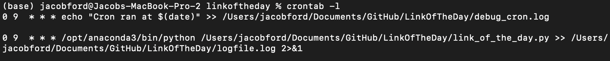

My father, who is 68 and approaching 69, is an incredibly industrious person — someone for whom a retirement without hobbies or activity would be a complete disaster. A friend of mine, in a similar situation with her concerningly available, bordering on bored, father sends dozens of scheduled emails with interesting ‘Link of the Week’ hyperlinks. These are interesting news articles, errata from the deep web, video clips, etc.

I loved this idea, but the thought of schedule sending a series of emails was a bit tedious. With a simple python script and a cronjob, I can just keep a csv updated with ‘send date’, the link, and a short description, and concatenate these into an email to send off to a parent!

## Technical Requirements
- Google gmail account with Two-Factor Authentication (2FA) enabled
- Generate an App Password, 16 character password for your app
- Save the password and your email address you wish to send to in your .env file; also, don’t commit your .env to github, in case you know, that happens, remove it!

## Python Script
The main function in the code is send_email; this uses MIME to format the email, think, constructing the to, from, subject, etc, parts of the email; and smtplib to send the email via SMTP, using your credentials in your .env file.

```{python}

def send_email(receiver_email, subject, body, sender_email, sender_password):
    """Sends an email with the given subject and body."""
    try:
        msg = MIMEMultipart()
        msg['From'] = sender_email
        msg['To'] = receiver_email
        msg['Subject'] = subject
        msg.attach(MIMEText(body, 'plain'))

        with smtplib.SMTP('smtp.gmail.com', 587) as server:
            server.starttls()
            server.login(sender_email, sender_password)
            server.send_message(msg)
            log_message(f"Email sent to {receiver_email}")
    except Exception as e:
        log_message(f"Error sending email to {receiver_email}: {e}")
        
```


## Cron Job
This cron job setup includes two scheduled tasks that run daily at 9 AM, see the 0 9 * * * line below). The first job is a simple test, logging the time it runs into a debug file to confirm that the cron scheduler is working properly.




The second job is the actual script execution, running the script daily at 9AM and saving the logfile to that logfile.log output, see below:


Check out the full github repo [here](https://github.com/Jake-Ford/LinkOfTheDay/tree/main), fork it, get your own links, and send away!