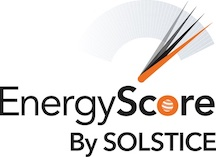

{ width=20% }

[Solstice](https://solstice-initiative.org/) EnergyScore, a machine learning algorithm that delivers a more effective and more equitable qualification metric. Through a grant, I spent several months investigating the degree of bias existing in the algorithm, conducting a large literature review to identify leading quantitative measures of bias and fairness in ML. Results, along with a more context + lit review can be found [here](http://energyscore-bias-research.s3-website.us-east-2.amazonaws.com/#content). 

Also at Solstice, we conducted a multi-tiered analysis of community solar prioritization and barriers to LMI access. Funding was provided by the U.S. Department of Energy's Solar Energy Technologies Office (SETO). This research looked at potential consumers, developers and financiers, and real performing solar farms. The data analysis and github page with more details and results are available [here](https://jake-ford.github.io/SETO_Data_Analysis/); currently a white paper is being drafted with co-authors Zahra Thani and Liz Neyens. Once available, I will link here. 